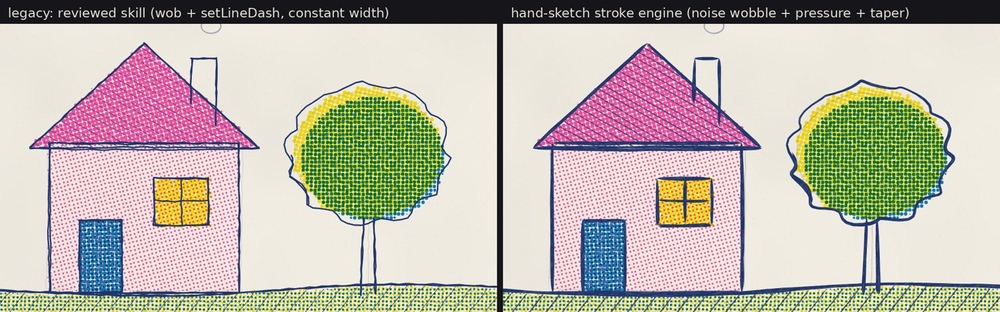
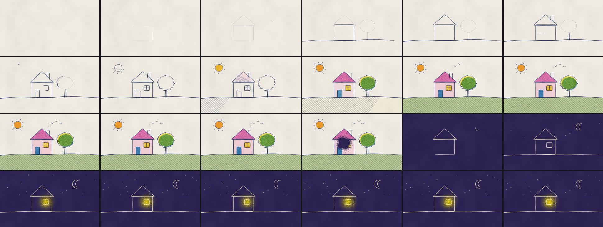

# hand-sketch

Hand-sketch-style animation done in code: deterministic Canvas 2D scenes with a variable-width stroke engine, composed into storyboard sequences, previewed live and rendered offline to mp4.





```bash
npm install
npm run dev        # interactive preview
npm run check      # typecheck + tests + build
npm run render     # out/sequence-16x9.mp4 (needs Chrome and ffmpeg)
```

See [AGENTS.md](AGENTS.md) for commands, architecture and invariants, and [NOTICE](NOTICE) for third-party attribution.
